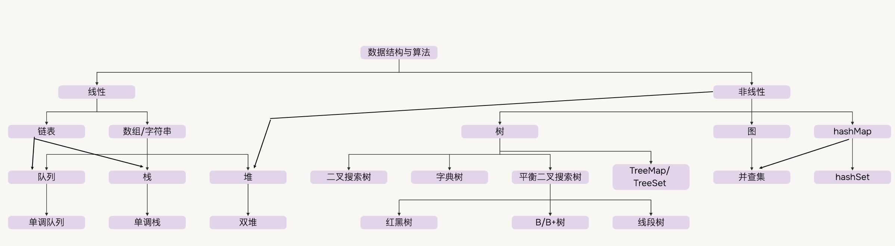

[English](./README.md) | [简体中文](.)

多个outline搭配使用: 使用Notion的database更方便： [leetcode 刷题记录](https://rust-wood-d05.notion.site/7fbe8b6a72294767a22ab7a11d0e7216?v=affd922f1c594366a63cfeea7f2a152e&pvs=4)

## Study RoadMap

- [basic](./docs/Basic.md) 基础

## Problem List

- [题单: blind75](./docs/Blind75.md) That cover the most common questions and question patterns asked within coding interviews

## By 数据结构

- [数组]
- [链表]
- [栈及队列]
- [树]
  - [二叉搜索树]
  - [字典树]
  - [完全二叉树/堆]
  - [并查集]
- [图]
- [字符串]
- [矩阵]

## By 算法

- [二分查找]
- [多指针]
- [BFS]
- [DFS]
- [减治]
  - [贪心]
- [动态规划]

## 外链

- [前端的数据结构与算法题]
